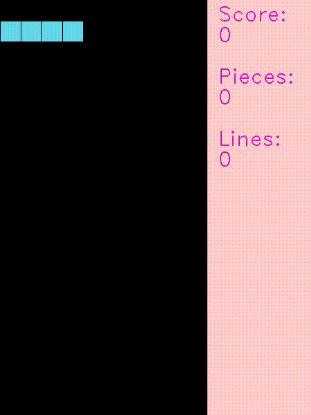

# Reinforcement Learning Project - Tetris

Repository for the avaliative work of the Reinforcement Learning subject in [PICME](https://picme.obmep.org.br) (Scientific Initiation and Master's Program). Project developed for Data Science and Artificial Intelligence graduation at FGV - EMAp.

## Developers

- [Bruno Kauan Lunardon](https://github.com/BrunoLunardon)
- [Zuilho Segundo](https://github.com/ZuilhoSe)
- [George Dutra](https://github.com/georgedutra)

## Abstract

The project's objective is to develop and train reinforcement learning models to play the game Tetris. It counts 3 different model implementations (2 reinforcement-learning-based and 1 heuristic model).

## Requirements

The project was entirely developed in Python v3.11. To install all the necessary packages, simply run the command line in your terminal with pip installed:

    pip install -r requirements.exe

## Structure

The project is structured by 4 folders and their files:

- `graphs`: Store the plots of data acquired throuh Tabular Q-Learning training;
- `qtables`: Store Tabular Q-Learning model's tables (be aware that Git LFS might be necessary);
- `trained_models`: Store trained Deep Q-Learning models;
- `src`: Folder containing main source files and their auxiliar files
    - `tetris.py`: Game main environment, implementated by the user [uvipen](https://github.com/uvipen/Tetris-deep-Q-learning-pytorch);
    - `dqn.py`: Deep Q-Learning implementation for training models;
    - `q_learning.py`: Tabular Q-Learning implementation for training models;
    - #TODO: arquivo principal de heuristicas

## References

Thanks to [uvipen](https://github.com/uvipen) for creating the Tetris environment we chose to use for the project, saving a lot of work with game implementations and allowing us to focus in machine learning.

Thanks to Harrison Kinsley for his [Q-Learning series](https://pythonprogramming.net/q-learning-reinforcement-learning-python-tutorial/), which inspired a lot of our project's coding.